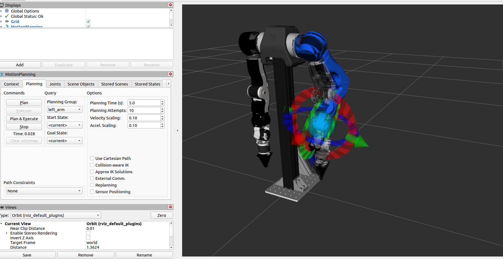

# 如何在本地实现OpenArm仿真

## 1. 环境准备

由于OpenArm需要使用ROS2，所以先安装ROS2。ROS2（机器人操作系统2）是一个现代开源的机器人软件构建框架：[ROS官网](https://www.ros.org/)

ROS2及其对应的ubuntu版本如下表所示：

| ROS2版本 | Ubuntu版本 |
| -------- | ----------- |
| Foxy     | 20.04       |
| Humble   | 22.04       |
| Jazzy    | 24.04       |

推荐使用Ubuntu22.04及以上版本。下面是Humble的安装过程：

对于OpenArm，建议按照如下方式安装Humble：

```bash
sudo apt install -y ros-humble-desktop
```

也可以安装基础版（无GUI工具，新手不推荐）

```bash
sudo apt install -y ros-humble-ros-base
```

Humble的其他介绍可见：[Humble安装指南](https://docs.ros.org/en/humble/Installation/Ubuntu-Install-Debs.html)

为了使用`openarm_ros2`软件包，还要安装以下依赖包：

```bash
sudo apt install -y \
ros-humble-controller-manager \
ros-humble-gripper-controllers \
ros-humble-hardware-interface \
ros-humble-joint-state-broadcaster \
ros-humble-joint-trajectory-controller \
ros-humble-joint-state-publisher-gui
```

安装下面这些依赖包使用`Moveit2`：

```bash
sudo apt install -y \
ros-humble-forward-command-controller \
ros-humble-moveit-configs-utils \
ros-humble-moveit-planners \
ros-humble-moveit-ros-move-group \
ros-humble-moveit-ros-visualization \
ros-humble-moveit-simple-controller-manager
```

安装完成之后，添加ROS2环境：

```bash
echo "source /opt/ros/humble/setup.bash" >> ~/.bashrc
source ~/.bashrc
```

安装Python相关开发工具：

```bash
sudo apt install -y \
python3-flake8-docstrings \
python3-pip \
python3-pytest-cov \
ros-dev-tools
```

安装完成之后，测试一下：

```bash
ros2 -h
ros2 topic list
```

如果能正常输出，则表示安装成功。

## 2. 下载并编译OpenArm机器人相关代码

在对机器人进行仿真和开发之前，我们要先构建OpenArm机器人。`openarm_description`用于实现OpenArm机器人的构建。

首先，需要创建工作空间和获取源码：

创建工作空间：

```bash
mkdir -p ~/ros2_ws/src && cd ~/ros2_ws/src
```

下载`openarm_description`源码：

```bash
git clone https://github.com/enactic/openarm_description.git
```

此代码支持OpenArm机器人`v1.0`版本和`v2.0`版本，详细的介绍见官网[Robot Description | OpenArm](https://docs.openarm.dev/api-reference/description)

除了构建机器人，还需要构建机器人的控制接口。由于机器人使用`CAN总线`进行通信，所以还需要安装OpenArm相关的CAN通信软件包：

```bash
sudo apt install -y libopenarm-can-dev openarm-can-utils
```

但是这一步在`Humble`中可能会出现无法定位软件包的情况，我们可以进行本地安装，先拉取代码：

```bash
cd ~/ros2_ws/src && vcs import < ./openarm_ros2/openarm.repos
```

`openarm_can`（[openarm_can代码地址](https://github.com/enactic/openarm_can/tree/main/dev)）的源代码会下载到src文件夹下面。

完成上述步骤之后，再下载OpenArm控制(`openarm_ros2`)相关的代码：

```bash
git clone https://github.com/enactic/openarm_ros2 ~/ros2_ws/src/openarm_ros2
```


下载完成之后，src文件夹下面有三个文件夹：`openarm_description`、`openarm_can`、`openarm_ros2`。

接下来进行编译，进入到工作空间地址：

```bash
cd ~/ros2_ws
```

安装`CAN`总线工具：

```bash
rosdep install --from-paths src --ignore-src -r -y
```

编译整个工作空间：

```bash
colcon build
```

编译时可能会出现`CLI11 `依赖缺失，安装相应的包即可：

```bash
sudo apt install -y libcli11-dev
```

如果你目前手里没有连接OpenArm的实体硬件和CAN卡，只是想在电脑上运行仿真、Mock虚拟硬件或者`Rviz`节点，你甚至不需要安装任何CAN驱动！直接使用官方提供的忽略参数进行编译即可：

```bash
colcon build --packages-ignore openarm_hardware
```

编译完成之后，添加环境：

```bash
source ~/ros2_ws/install/setup.bash
```

由于这里只进行仿真，所以不用对电机等硬件设施进行初始化，如果需要使用硬件，在使用之前，必须注意以下几点：

| 要点     |   说明 |
| -------- | ----------- |
| 硬件初始化     | 对全部硬件都进行了初始化配置       |
| 调零   | 确保所有电机都设置了安全的零位       |
| 紧急停止    | 始终将紧急停止按钮放在手边       |
| 清理工作区    | 移除所有障碍物、工具和人员，离开手臂活动区域       |
| 断电    | 知道如何在需要时快速断电       |


> 操作不当可能导致严重伤害或设备损坏，永远把**安全放在首位**！！！

## 3. OpenArm机器人仿真

编译完成之后，测试一下仿真能否正常运行，下列指令运行其中一条就行。

启动v2.0机器人仿真：

```bash
ros2 launch openarm_bringup openarm.bimanual.launch.py arm_type:=v2.0
```

启动v1.0机器人仿真：

```bash
ros2 launch openarm_bringup openarm.bimanual.launch.py arm_type:=v1.0
```

启动实际的机器人：

```bash
ros2 launch openarm_bringup openarm.bimanual.launch.py arm_type:=v2.0 use_fake_hardware:=false right_can_interface:=can0 left_can_interface:=can1
```

下面对指令进行说明：

`openarm_bringup`：提供与ROS2控制框架集成的启动文件。该软件包提供启动文件和配置，用于启动硬件接口、加载控制器并将实体机械臂连接到ROS2生态系统。启动之后，你可以使用标准ROS2控制工具和接口来指挥机械臂并接收反馈。

`openarm.bimanual.launch.py`：配置双臂相关参数。

相关参数说明：

- **arm_type**：设置v1.0机器人和v2.0机器人，默认设置为openarm_v2.0
- **use_fake_hardware**：是否使用仿真，true:仿真，false:实际机器人，默认为true
- **right_can_interface**：右臂的CAN接口，默认设置为can0
- **left_can_interface**：左臂的CAN接口，默认设置为can1
- **robot_controller**：控制器类型，可选的有joint_trajectory_controller和forward_position_controller，默认为joint_trajectory_controller
- **arm_prefix**：Prefix for topic namespacing，用于多个机器人，默认为空
- **controllers_file**：控制器配置文件，默认为openarm_bimanual_controllers.yaml

仿真成功启动之后，可以通过查看`topic`来检查机器人是否正常工作：

```bash
ros2 topic list
ros2 action list
```

各个`topic`及其说明如下：

| **Topic** | **Type** | **Description** |
| --- | --- | --- |
| **/joint_states** | sensor_msgs/JointState | 所有节点的当前联合态 |
| **/dynamic_joint_states** | control_msgs/DynamicJointState | 动态联合态 |
| **/robot_description** | std_msgs/String | 机器人URDF描述 |
| **/tf** | tf2_msgs/TFMessage | 变换树 |
| **/tf_static** | tf2_msgs/TFMessage | 静态变换 |
| **/left_joint_trajectory_controller/joint_trajectory** | trajectory_msgs/JointTrajectory | 左臂轨迹输入 |
| **/right_joint_trajectory_controller/joint_trajectory** | trajectory_msgs/JointTrajectory | 右臂轨迹输入 |
| **/left_joint_trajectory_controller/state** | control_msgs/JointTrajectoryControllerState | 左臂控制器状态 |
| **/right_joint_trajectory_controller/state** | control_msgs/JointTrajectoryControllerState | 右臂控制器状态 |
| **/left_gripper_controller/joint_trajectory** | trajectory_msgs/JointTrajectory | 左侧抓钳轨迹输入 |
| **/right_gripper_controller/joint_trajectory** | trajectory_msgs/JointTrajectory | 右侧抓钳轨迹输入 |
| **/left_gripper_controller/state** | control_msgs/JointTrajectoryControllerState | 左侧抓钳控制器状态 |
| **/right_gripper_controller/state** | control_msgs/JointTrajectoryControllerState | 右侧抓钳控制器状态 |

各个`action`及其说明如下：

| **Action** | **Type** | **Description** |
| --- | --- | --- |
| /left_joint_trajectory_controller/follow_joint_trajectory | control_msgs/action/FollowJointTrajectory | 左臂执行轨迹 |
| /right_joint_trajectory_controller/follow_joint_trajectory | control_msgs/action/FollowJointTrajectory | 右臂执行轨迹 |
| /left_gripper_controller/follow_joint_trajectory | control_msgs/action/FollowJointTrajectory | 左侧抓钳执行轨迹 |
| /right_gripper_controller/follow_joint_trajectory | control_msgs/action/FollowJointTrajectory | 左侧抓钳执行轨迹 |

发布`action`测试关节运动：

```bash
ros2 action send_goal /left_joint_trajectory_controller/follow_joint_trajectory control_msgs/action/FollowJointTrajectory \
'{trajectory: {joint_names:["openarm_left_joint1", "openarm_left_joint2", "openarm_left_joint3", "openarm_left_joint4", "openarm_left_joint5", "openarm_left_joint6", "openarm_left_joint7"], points:[{positions:[0.15, 0.15, 0.15, 0.15, 0.15, 0.15, 0.15], time_from_start:{sec: 3, nanosec: 0}}]}}'
```

## 4. Moveit2集成

MoveIt2（[MoveIt 2](https://moveit.picknik.ai/main/index.html)）是一个强大的机器人机械臂框架，结合了逆向运动学、感知、路径规划和控制能力。MoveIt2演示启动时，移动组、视野、ROS2控制和所有控制器都在同一个命令中启动。

启动仿真机器人和`Moveit2`：

```bash
ros2 launch openarm_bimanual_moveit_config demo.launch.py arm_type:=v2.0
```

启动真实机器人：

```bash
ros2 launch openarm_bimanual_moveit_config demo.launch.py arm_type:=v2.0 use_fake_hardware:=false right_can_interface:=can0 left_can_interface:=can1
```

相关的参数设置与**仿真**中一致。

运行成功之后，`Rviz`中将会出现如下界面：




可在左侧`MotionPlanning`面板的选项卡中设置目标位置。也可直接拖动并旋转机械臂末端，调整至目标姿态。或者展开`JointsPlanningGoal State`列表，从中选择预设关键点来设定目标。


该标签页提供图形用户界面，用于生成达到目标位置的轨迹。点击`Planning > Plan`预览路径。

**出于安全考虑，默认增益设置为较低数值**。这会导致机械臂在部分场景下无法到达大角度位置，可通过编辑下述配置文件并重新编译的方式调整增益。

对于v2.0版本，编辑如下文件：

```
~/ros2_ws/src/openarm_description/assets/robot/openarm_v2.0/config/arm/control/control_gains.yaml
```

对于v1.0版本，编辑如下文件：

```
~/ros2_ws/src/openarm_description/assets/robot/openarm_v1.0/config/arm/control_gains.yaml
```

更改之后需要重新编译才能生效：

```bash
cd ~/ros2_ws
colcon build
```

> 调整增益时务必谨慎操作。请先使用较低增益值测试设备运行状态，确认无误后再逐步调高增益。若在高增益模式下执行位置偏差较大的动作，部分控制器会产生极高的运行速度，存在安全隐患。

> 此外，OpenArm的详细介绍可以在[OpenArm使用说明](https://docs.openarm.dev/api-reference/)中进行查看。
